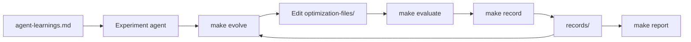

# ACTS Seeding Autoresearch

An experiment platform for making ACTS Seeding2 faster without sacrificing reconstruction quality.
It runs controlled candidates on the fixed ITk workload through ACTS on HEPP02, keeps the results, and helps the next experiment build on what worked.
The active protocol uses ACTS v46.5.0, one ACTS thread, 10-event development runs, and 50-event evaluation runs.
Each timed comparison has three repetitions, with the median timing and particle ambiguity efficiency used for candidate comparison.

[Open the interactive report](https://aksth070600.github.io/autoresearch-acts-seeding/)

## How the repository works



- `optimization-files/` contains the ACTS implementation files an experiment may change.
- `make evolve` selects a promising implementation from successful history under the active protocol.
  Eligibility and Pareto selection use only total full-chain time per event and particle ambiguity-resolution efficiency.
  Other metrics remain diagnostics.
- `make evaluate CANDIDATE=name` runs the controlled development workload.
- `make record CANDIDATE=name` returns the latest summary and failure details without editing the archive.
- `make evaluate-selected` evaluates Genesis, the two strongest particle ambiguity-efficiency candidates, and two lowest-time candidates, filling overlaps with the next unique candidates.
- `records/` stores reproducible summaries used by evolution and reports.
- `agent-learnings.md` stores short lessons so agents do not repeat failed ideas.
- `Genesis` is the starting point for every campaign. Successful development baselines use timestamped `records/Development/*-Genesis/` directories; the legacy canonical Genesis summary remains readable for compatibility. Evolution selects the latest complete protocol-compatible Development Genesis record.
- Reports show one Genesis point as the arithmetic mean of all protocol-compatible Genesis runs in the selected dataset, with sample count and source records. Candidate records remain individual points. The interactive report lets you switch between Development and Evaluation; each view stays within its selected category.

## Start an experiment agent

From the repository root, start your coding agent and give it this prompt:

```text
Hi, have a look at agent-instructions.md and let's kick off a new experiment.
Let's do the setup first.
```

The full operating contract is in [`agent-instructions.md`](agent-instructions.md).

## Useful commands

```text
make evolve
make evaluate CANDIDATE=<candidate-name>
make evaluate CANDIDATE=<candidate-name> EVALUATION=1
make record CANDIDATE=<candidate-name>
make select-evaluation
make evaluate-selected
make report
```

`make evaluate` runs 10-event development stages. `EVALUATION=1` runs the 50-event evaluation stages for captain/operator-controlled review. Timed stages run three repetitions and store every repetition plus their median in each summary.

Focused protocol and objective tests run with:

```text
/usr/bin/python3 -m unittest discover -s tests -v
```

The pinned Python dependency is installed with:

```text
/usr/bin/python3 -m pip install --user -r orchestration-files/requirements.txt
```
