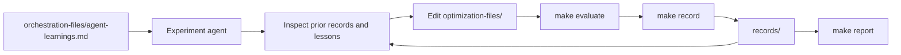

# ACTS Seeding Autoresearch

An experiment platform for making ACTS Seeding faster without sacrificing reconstruction quality.
It runs controlled candidates on the fixed ITk workload through ACTS on HEPP02, keeps the results, and helps the next experiment build on what worked.
The active protocol uses ACTS v46.5.0, one ACTS thread, 10-event development runs, and 50-event evaluation runs.
Each timed comparison has three repetitions, with the median seeding timing and particle ambiguity efficiency used for candidate comparison. Full-chain and CKF timing remain diagnostic.

[Open the interactive results report](https://aksth070600.github.io/autoresearch-acts-seeding/)

[Open the live campaign dashboard](https://aksth070600.github.io/autoresearch-acts-seeding/campaign/)

## How the repository works



- `optimization-files/` contains the ACTS implementation files an experiment may change.
- Prior controlled records and `orchestration-files/agent-learnings.md` provide deterministic evidence for new hypotheses. Pareto comparison uses only timed seeding time per event and particle ambiguity-resolution efficiency. Full-chain and CKF timing remain diagnostics unless the candidate changes those implementation areas.
- `make evaluate CANDIDATE=name` runs the controlled development workload.
- `make record CANDIDATE=name` returns the latest summary and failure details without editing the archive.
- `make campaign-status` builds the live snapshot. See [`orchestration-files/CAMPAIGN_STATUS.md`](orchestration-files/CAMPAIGN_STATUS.md).
- `make evaluate-selected` is captain/operator-only. It evaluates Genesis, the two strongest particle ambiguity-efficiency candidates, and two lowest-seeding-time candidates, filling overlaps with the next unique candidates.
- `records/` stores reproducible summaries used by deterministic Evaluation selection and reports.
- `orchestration-files/agent-learnings.md` stores short lessons so agents do not repeat failed ideas.
- `Genesis` is the starting point for every campaign. Successful development baselines use timestamped `records/Development/*-Genesis/` directories; the legacy canonical Genesis summary remains readable for compatibility. Deterministic Evaluation selection uses the latest complete protocol-compatible Development Genesis record.
- Reports show one Genesis point as the arithmetic mean of all protocol-compatible Genesis runs in the selected dataset, with sample count and source records. Candidate records remain individual points. The interactive report lets you switch between Development and Evaluation; each view stays within its selected category.

## Start an experiment agent

From the repository root, start your coding agent and give it this prompt:

```text
Hi, have a look at agent-instructions.md and let's kick off a new experiment.
Let's do the setup first.
```

The full operating contract is in [`agent-instructions.md`](agent-instructions.md).

## Standard campaign composition

A standard campaign completes exactly 20 unique candidate experiments: 10 major candidates, 5 minor candidates, and 5 combination candidates. Major candidates make substantive algorithm, traversal, allocation, data-layout, pruning, search-bound, or data-flow changes. Minor candidates make bounded local optimizations. Each combination candidate tests a specific interaction between at least two earlier, directly inspected candidate mechanisms. The authoritative numeric composition is in `orchestration-files/protocol.py`.

## Useful commands

```text
make evaluate CANDIDATE=<candidate-name>
make evaluate CANDIDATE=<candidate-name> EVALUATION=1
make record CANDIDATE=<candidate-name>
make select-evaluation
make evaluate-selected
make report
make campaign-status
```

`make report` writes the historical report and live campaign page to the ignored `build/site/` directory.
`make evaluate` runs 10-event development stages. `EVALUATION=1` runs the 50-event evaluation stages for captain/operator-controlled review. Timed stages run three repetitions and store every repetition plus their median in each summary.

The orchestration and report tools use the Python standard library. Run the full repository tests with:

```text
/usr/bin/python3 -m unittest discover -s orchestration-files/tests -v
```
