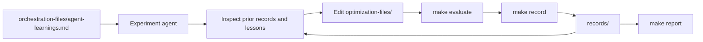

# ACTS Seeding Autoresearch

An experiment platform for making ACTS Seeding faster without sacrificing reconstruction quality.
It runs controlled candidates on the fixed ITk workload through ACTS on HEPP02, keeps the results, and helps the next experiment build on what worked.
The active `acts-seeding-v3` protocol uses ACTS v46.5.0, one ACTS thread, and the same seeding-only stage matrix for Development and captain-authorized Evaluation.
Each run has one uninstrumented 1-event smoke stage, three uninstrumented 10-event timing repetitions, and one separate instrumented 10-event Peak RSS stage. Pareto comparison uses median seeding time and seeding particle efficiency. Peak RSS is diagnostic.

[Open the interactive results report](https://aksth070600.github.io/autoresearch-acts-seeding/)

[Open the live campaign dashboard](https://aksth070600.github.io/autoresearch-acts-seeding/campaign/)

## How the repository works



- `optimization-files/` contains the ACTS implementation files an experiment may change.
- Prior controlled records and `orchestration-files/agent-learnings.md` provide deterministic evidence for new hypotheses. Pareto comparison uses only seeding time per event and seeding-stage particle efficiency.
- `make evaluate CANDIDATE=name` runs the controlled development workload.
- `make record CANDIDATE=name` returns the latest summary and failure details without editing the archive.
- `make campaign-status` builds the live snapshot. Continuous workers use `make campaign-check-stop`, `make campaign-consume-stop`, and `make campaign-finalize` at safe boundaries. See [`orchestration-files/CAMPAIGN_STATUS.md`](orchestration-files/CAMPAIGN_STATUS.md).
- `make evaluate-selected` is captain/operator-only. It evaluates Genesis, the two strongest seeding-efficiency candidates, and two lowest-seeding-time candidates, filling overlaps with the next unique candidates.
- `records/` stores reproducible summaries used by deterministic Evaluation selection and reports.
- `orchestration-files/agent-learnings.md` stores short lessons so agents do not repeat failed ideas.
- `Genesis` is the starting point for every campaign. Successful development baselines use timestamped `records/Development/*-Genesis/` directories; the legacy canonical Genesis summary remains readable for compatibility. Deterministic Evaluation selection uses the latest complete protocol-compatible Development Genesis record.
- Reports show one Genesis point as the arithmetic mean of all protocol-compatible Genesis runs in the selected dataset, with sample count and source records. Candidate records remain individual points. The interactive report lets you switch between Development and Evaluation; each view stays within its selected category.

## Start an experiment agent

From the repository root, start your coding agent and give it this prompt:

```text
Hi, have a look at agent-instructions.md and let's kick off a new experiment.
Let's do the setup first.
```

The full operating contract is in [`agent-instructions.md`](agent-instructions.md).

## Campaign composition

Archived fixed campaigns complete exactly 20 unique candidate experiments: 10 major candidates, 5 minor candidates, and 5 combination candidates. Continuous Development campaigns run until an authenticated stop request, follow the same 50%/25%/25% composition through deterministic deficit scheduling, and finalize at the smallest reachable positive exact 2:1:1 ratio. A combination remains ineligible until compatible completed sources and full provenance are available. The authoritative composition contracts are in `orchestration-files/protocol.py`; scheduler and control operations are documented in [`orchestration-files/CAMPAIGN_STATUS.md`](orchestration-files/CAMPAIGN_STATUS.md).

## Useful commands

```text
make evaluate CANDIDATE=<candidate-name>
make evaluate CANDIDATE=<candidate-name> EVALUATION=1
make record CANDIDATE=<candidate-name>
make select-evaluation
make evaluate-selected
make report
make campaign-status
make campaign-check-stop
make campaign-consume-stop
make campaign-finalize
```

`make report` writes the historical report and live campaign page to the ignored `build/site/` directory. The live page can route a signed-in captain to the least-privilege GitHub Actions finish workflow for a selected open continuous campaign. The static page contains no credential and makes no privileged request.
`make evaluate` runs the controlled seeding-only 1 + 3 + 1 matrix and writes Development records. `EVALUATION=1` uses the same matrix and writes captain-controlled Evaluation records. The three uninstrumented timing repetitions own median, range, and MAD. The separate GNU `time -v` stage owns Peak RSS.

The orchestration and report tools use the Python standard library. Run the full repository tests with:

```text
/usr/bin/python3 -m unittest discover -s orchestration-files/tests -v
```
